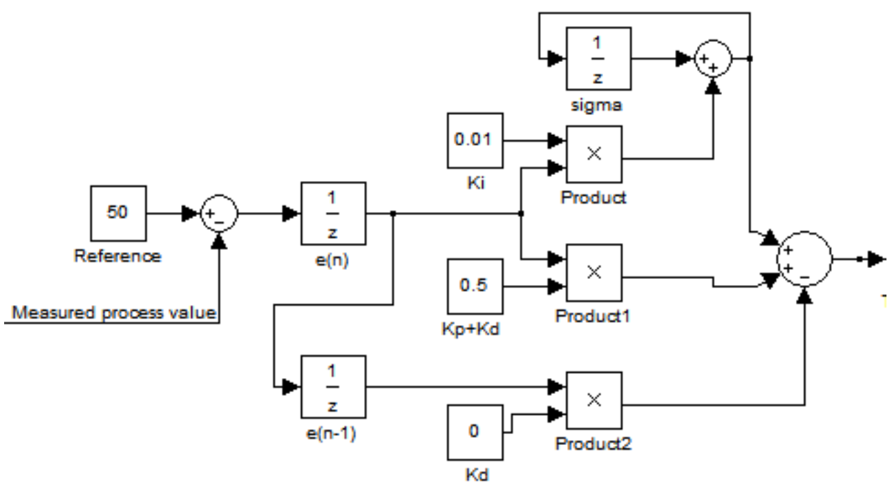
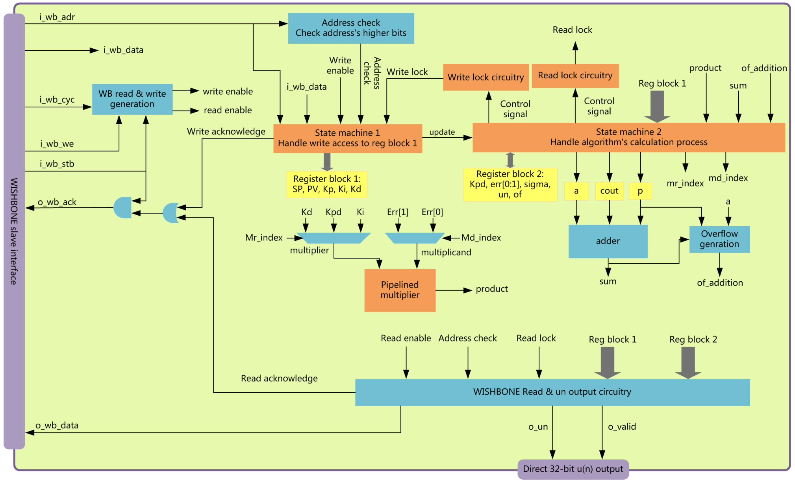
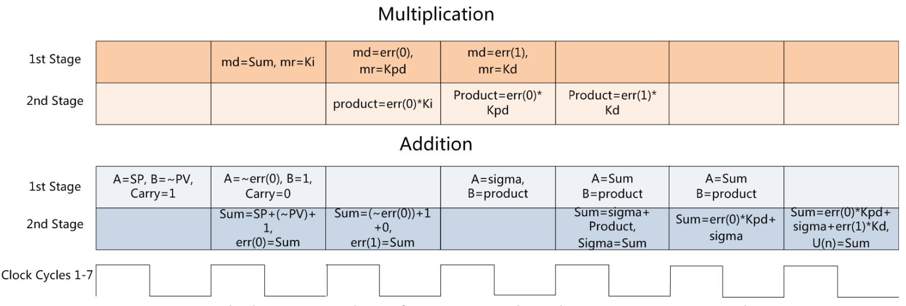

# Single Variable PID Controller

The PID controller IP core performs a digital proportional–integral–derivative controller (PID controller) algorithm. The algorithm first calculates the error between a measured value (PV) and its ideal value (SP), then uses the error as an argument to calculate the manipulated value (MV). The MV will adjust the process to minimize the error. It can be used to calculate the duty cycle for PWM (Pulse Width Modulation).

## Features

- 16-bit signed coefficient and data input: Kp, Ki, Kd, SP, and PV.
- 32-bit signed u(n) output.
- Contains one high-speed 32-bit prefix-2 Han-Carlson adder and one high-speed pipelined 16x16-bit multiplier.
- Latency from input of PV to finished calculation and update of u(n) is 9 clock cycles.
- Ki, Kp, Kd, SP, PV can be updated anytime after reset.
- After every update of Kp or Kd, register Kpd which stores Kp+Kd will be calculated and updated.
- After every update of PV, calculation and update of e(n), e(n-1), sigma, and u(n) will be triggered in sequence.
- Overflow register records overflow signals when calculating Kpd, e(n), e(n-1), u(n), and sigma.
- Uses 2278 of 4608 (49%) Core Cells in Actel A2F200M3F FPGA and runs at 100MHz clock frequency.
- Wishbone B4 compliant interface. Supports 16-bit, 32-bit, and 64-bit bus width.

## PID Controller Description

Below describes the algorithm of the PID controller.

### Analog

A PID is made of three basic blocks whose outputs are:

- Proportional to the input
- The integral of the input
- The derivative of the input

**Figure 1:** Block diagram of a generic system controlled by a PID controller. The goal of the PID block is to generate an output u(t) that drives the system at hand (the “PLANT”) so that its output [y(t) or PV, Process Value] matches a reference signal [x(t) or SP, Set Point]. The input to the PID is the error between the reference signal (ideal or desired behavior of the PLANT) and the real output behavior. The target is to get the error as close to zero as possible.

The equation that describes the PID controller behavior in the continuous time domain is shown in Equation 1.

### Digital

Transform Equation 1 into the discrete time domain to get Equation 2.

$ u(n) = Kp \cdot e(n) + Ki \cdot \sum_{j=1}^{n} e(j) + Kd \cdot (e(n) - e(n-1)) $

**Equation 2**

From Equation 2, we can construct the algorithm's block diagram shown in Figure 2.

**Figure 2:** Digital PID controller algorithm

## Architecture

**Figure 3:** Block diagram of the core's architecture. The blue blocks are combinational logic, the orange blocks are sequential logic, the yellow blocks are registers, and the purple ones are interfaces.

## Operation

### Coefficients and Data Update

Coefficients (Kp, Ki, Kd, SP) and measured process value (PV), which are all 16-bit signed numbers in two's complement, are stored in different registers that can be read and written any time after reset by a host through the Wishbone slave interface. Normally, Kp, Ki, Kd, SP are updated right after reset before continuously updating PV. You can also update coefficients randomly for dynamic tuning. Writing action to specific registers mentioned above won’t be responded to until the finished calculation of the last u(n).

### Calculation of u(n)

The final result u(n) is a 32-bit signed number in two's complement. Calculation of u(n) will be triggered every time PV is updated. The calculation procedure is demonstrated in Figure 4.

**Figure 4:** Calculation procedure of u(n). Sum and product are wire type signals.

### Update of Overflow Register

The overflow register records any overflow signal in previous calculations of Kpd, e(n), e(n-1), u(n), and sigma. It will be updated after every addition operation. If any of the 5 overflow register bits is set, then the final u(n) is incorrect.

### Start a New Sequence of U(n) Calculation

If you want to start a new sequence of U(n) calculation, you need to dump values stored in register err[0], OF, un, and sigma. That’s done by writing 0 to RS. You can also use a system reset which will reset the entire core.

## Registers

Initial values of all registers are zeros after reset. When in 16-bit bus width mode, the data read from a 32-bit register is the lower 16 bits. When in 32-bit bus width mode, the data read from a 16-bit register is formed by the register’s data in the lower 16 bits and replications of the sign bit in the upper 16 bits. When in 64-bit bus width mode, all upper bits of read data are stuffed with the sign bit except from register OF.

| Name   | Address for 16-bit/32-bit/64-bit bus width | Width | Access | Description                                |
|--------|--------------------------------------------|-------|--------|--------------------------------------------|
| Kp     | Base+0x0/0x0/0x0                           | 16    | R/W    | Stores coefficient Kp                      |
| Ki     | Base+0x2/0x4/0x8                           | 16    | R/W    | Stores coefficient Ki                      |
| Kd     | Base+0x4/0x8/0x10                          | 16    | R/W    | Stores coefficient Kd                      |
| SP     | Base+0x6/0xC/0x18                          | 16    | R/W    | Stores reference SP                        |
| PV     | Base+0x8/0x10/0x20                         | 16    | R/W    | Stores PV                                  |
| Kpd    | Base+0xA/0x14/0x28                         | 16    | R      | Stores coefficient Kp+Kd                   |
| err[0] | Base+0xC/0x18/0x30                         | 16    | R      | Stores e(n)                                |
| err[1] | Base+0xE/0x1C/0x38                         | 16    | R      | Stores e(n-1)                              |
| un     | Base+0x10/0x20/0x40                        | 32    | R      | Stores u(n)                                |
| sigma  | Base+0x12/0x24/0x48                        | 32    | R      | Stores \(\sum_{j=1}^{n} e(j) \cdot Ki\)    |
| OF     | Base+0x14/0x28/0x50                        | 5     | R      | Overflow flags for calculations            |
| RS     | Base+0x16/0x2C/0x58                        |       | R/W    | Write 0 to reset err[0], un, sigma, and OF |

## I/O Ports

The IP core has a Wishbone Slave Interface and another interface for direct 32-bit u(n) output.

### Wishbone Slave Interface

It's Wishbone B4 compliant.

| Name      | Name in Wishbone B4 | Size     | Direction | Description                                                      |
|-----------|---------------------|----------|-----------|------------------------------------------------------------------|
| i_clk     | CLK_I               | 1        | input     | Clock input                                                      |
| i_rst     | RST_I               | 1        | input     | Reset input                                                      |
| i_wb_cyc  | CYC_I               | 1        | input     | Indicates valid bus cycle (core select)                          |
| i_wb_stb  | STB_I               | 1        | input     | Indicates valid data transfer cycle                              |
| i_wb_we   | WE_I                | 1        | input     | Write transaction when asserted high                             |
| i_wb_adr  | ADR_I               | 16       | input     | Address input                                                    |
| i_wb_data | DAT_I               | 16/32/64 | input     | Data input                                                       |
| o_wb_ack  | ACK_O               | 1        | output    | Acknowledgment output (indicates normal transaction termination) |
| o_wb_data | DATA_O              | 16/32/64 | output    | Data output                                                      |

### Direct 32-bit u(n) Output

| Name    | Size | Direction | Description          |
|---------|------|-----------|----------------------|
| o_un    | 32   | output    | u(n) output          |
| o_valid | 1    | output    | Indicates valid o_un |
